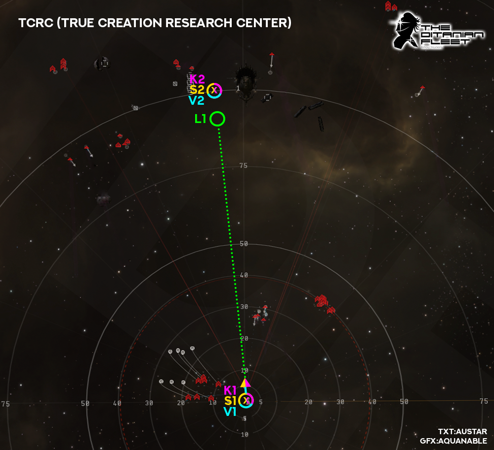

# Anchoring
Below you will find visual and written guidance on anchoring and bastion points in the new meta, but please remember this is guidance only, different situations and events can and will change the course of your anchoring and bastion activation so it is by no means a be all and end all guide. Hopefully however it will help newer pilots to understand where and when to anchor/bastion. All guidance is subject to change too so check back as we continue to figure out the best way to keep our isk/h going up!

## Legend
Symbol | Meaning
-------|--------
o | Anchor point
x | Bastion point
▫️ ▫️ ▫️ | Flight path
K1/2/3 | Kronos (pink)
V1/2/3/4 | Vindicator (blue)
S1/2/3 | Paladin/Nightmare (yellow)
L1 | Logistics (green)
:white_circle: | MJD Landing point

### TPPH First room

Bastions:
* Turn left, burn towards outgate, bastion as soon as you reach top speed, should roughly be 1/3 through your burn, this lets you drift towards outgate. Switch to conflag as paladin, Null for kronos unless all three battleships within Void range.

Vindi:
* You should pick a Romi or Osti and burn to within Void range, shoot and web seperate targets, "drive-by" shoot these targets but use common sense, if fleet is slow, stay and shoot it with void longer, if someone is already going for your target, pick one which doesnt have a vindi friend!

Logi:
*  Turn left, burn to outgate. 

---
### TPPH Second room

Bastions:
* Start with Scorch/Null, burn towards outgate, bastion as soon as you reach top speed, drift towards outgate. Switch to conflag as Paladin once in range, Null for kronos entire room

Vindi:
* Pick a Romi or Osti and burn to within Void range, shoot and web seperate targets, "drive-by" shoot these targets, if someone is already going for your target, pick a different one!

Logi:
* Burn to outgate. 

---
### TPPH Third Room

Bastions:
* Bastion as soon as you land on beacon "Its Tama Time!", once bastion cycle ends align to the left of tower and up roughly 20km each direction, as Kronos your aiming to jump right on-top of 2nd wave spawn but you are burning 10km back so as to be in range for both wave spawns. As paladin you want to MJD roughly 10km from spawn so you land between spawn and tower, Paladins should also burn back 10km to be in opti range of all wave spawns and tower. 

Vindi:
* You should pick a Romi or Osti and burn to within Void range, shoot and web seperate targets, "drive-by" shoot these targets but use common sense, if fleet is slow, stay and shoot it with void longer, if someone is already going for your target, pick one which doesnt have a vindi friend!

Logi:
*  Turn left, burn to out gate. 

## NRF

## TCRC

