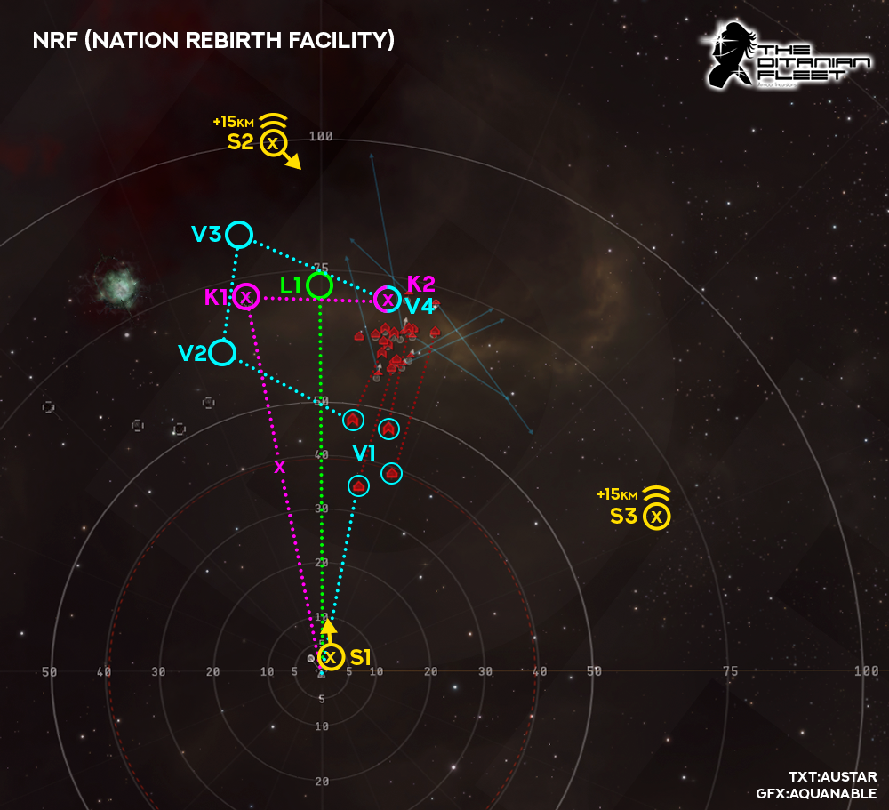

# Anchoring
Below you will find visual and written guidance on anchoring, bastion points and when to Micro Jump Drive in the new meta, but please remember this is guidance only, different situations and events can and will change the course of your anchoring, bastion activation and MJD, so it is by no means a "one and only" guide. Hopefully however it will help newer pilots to understand where and when to anchor, bastion & MJD. All guidance is subject to change too so check back as we continue to figure out the best way to keep our isk/h going up. **Remember, FC intructions overule any guidance!**

Note: All images are shown as a top down overview of each room/site with the tactical overlay enabled.

## Legend
Symbol | Meaning
-------|--------
o | Anchor point
x | Bastion point
▫️ ▫️ ▫️ | Flight path
K1/2/3 | Kronos (pink)
V1/2/3/4 | Vindicator (blue)
S1/2/3 | Paladin/Nightmare (yellow)
L1 | Logistics (green)
♂️ | MJD Direction
:white_circle: | MJD Landing point
(( | Elevation Distance

## TPPH First room

Bastions:
* Turn left, burn towards outgate (K1 & S1), start with Scorch/Null, bastion as soon as you reach top speed, you should be roughly 1/3 through your burn (see x), this lets you drift towards outgate while maintaing bastion. Switch to Conflag paladin's as you enter bastion, Null for kronos unless all three battleships are within Void range.

Vindi:
* You should pick a Romi or Osti and burn to within Void range (V1), web seperate targets and call your webs, "drive-by" shoot these targets, but use common sense, if fleet is slow, stay and shoot it with void longer. If someone is already going for your target, pick one which doesnt have a vindi friend! Once your target reaches armor burn to outgate (V2)

Nightmare:
* Turn left, burn to outgate (S1), switch to conflag once targets are within range.

Logi:
*  Turn left, burn to outgate (L1). 

---
### TPPH Second room

Bastions:
* Start with Scorch/Null, burn towards outgate (K1 & S1), bastion as soon as you reach top speed (see x), drift towards outgate. Switch to Conflag Paladin's once Sansha in range, Null for kronos entire room unless several targets in void range.

Vindi:
* Pick a Romi or Osti and burn to within Void range (V1), web seperate targets and call your webs, "drive-by" shoot these targets, if someone is already going for your target, pick a different one. Once target hits armor, burn to outgate (V2)

Nightmare:
* Burn straigh to outgate (S1), switch to Conflag where appropriate to apply max DPS.

Logi:
* Burn to outgate (L1). 

---
### TPPH Third Room

Bastions:
* Bastion one cycle as soon as you land on beacon (K1 & S1) use Scorch/Null "Its Tama Time!", once bastion cycle ends Q align to the left of tower and up, add roughly 20km for each plane, as Kronos your aiming to jump right on-top of 2nd wave spawn (see pink MJD landing point) but you are burning 10km back (K2) to be in Void range for both 2nd & 3rd wave. As paladin you want to MJD roughly 10km from 2nd wave spawn and make sure to add 20km or so elevation (see yellow MJD landing point) so that you land between the wave and tower, Paladins should also burn back 10km (S2) to be in opti range with conflag of all wave spawns and tower. **Burning back here is VERY important for both bastion ships as it allows you to stay in bastion throughout both waves and be in opti range of high dps ammo.** Kronos should burn to the final anchor point (K3) once 3rd wave is nearly dead.

Vindi:
* Webs are key to fast site times, you should pick a Romi or Osti and burn to within Void range (V1), web seperate targets and call your webs, "drive-by" shoot these targets, if someone is already going for your target, pick a different one. Anchoring for the next two waves is more important here so do not waste time and keep burning to your next anchor (V2) you need to be in position before the 2nd wave spawns. During 2nd wave spread your webs, call them, and as the wave is dying slowboat to your next anchor point (V3), when the 3rd wave spawns its the same process as the previous wave, spread webs, call them, slowboat anchor to your final point (V4) on the tower.

Logi:
*  Its important to get away from the beacon quickly here, use the gate sliding technique so you can get to your anchor (L1) asap. With everyone in bastion on the beacon and most of the NPC's out of range, there is low damage from NPC's, however should a pilot make a mistake and MJD into the aggro you want to be burning into rep range as fast as possible. Make sure to elevate your anchor point so that you are inline with top of tower roughly.

## NRF

Bastions:
* Paladins one cycle bastion as soon as you land on beacon (S1) Nightmares, sit still once mara is dead/bastion ends snipers can jump forward toward anchor point (S2)

## TCRC

